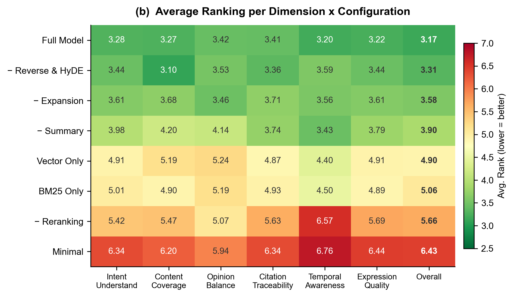

# 模型评估

## 1. 评估概述

### 1.1 评估动机

传统 RAG 系统常用 Recall@K、Precision@K 等指标进行评估，但这些指标不适用于酒店评论场景，原因在于：

- **无标准答案**: 评论是多位住客的主观体验，不存在唯一标准答案，需综合多条评论给出参考性回复
- **检索复杂性**: 即使一条评论完美回答了用户的问题也未必被采用，需综合考虑其内容质量和时效性等因素
- **模糊意图处理**: 用户的模糊提问应被多维度拆解回答，而非简单给出答案，这一过程可能引入看似无关但有效的信息
- **场景区分度低**: 酒店评论属日常场景，若对每次回复进行独立的绝对评分，评估模型给出的分数往往相近，难以有效区分优劣

因此，本项目采用 **排名制（Ranking-based）评估** 替代绝对评分制：同一问题下，将多个系统配置的回复进行横向对比排序，以放大差异、量化各组件的边际贡献。

### 1.2 评估流程

```
评测数据集生成 → 消融实验配置 → 批量生成 RAG 回复 → 排名评估 → 结果可视化
```

---

## 2. 评测数据集

### 2.1 构建策略

评测数据集共包含 **100 个问题**，按以下策略构建：

| 类别 | 数量 | 构建方式 | 说明 |
|------|------|---------|------|
| **结构化问题** | 70 | 用户画像 × 意图方向 = 5 × 14 | 系统性覆盖主要场景 |
| **模糊性问题** | 10 | 开放性、复合意图 | 测试模糊意图处理能力 |
| **时效性问题** | 10 | 5 个明确 + 5 个隐含 | 测试时效性响应能力 |
| **特定房型问题** | 10 | 4 个模糊房型 + 6 个精确房型 | 测试房型约束过滤能力 |

### 2.2 用户画像与意图方向

**用户画像** (5类): 家庭亲子、商务出差、朋友出游、情侣出游、独自旅行

**意图方向** (14类): 与离线知识库的二级分类体系对齐，涵盖房间设施、公共设施、餐饮设施、前台服务、客房服务、退房/入住效率、交通便利性、周边配套、景观/朝向、价格合理性、性价比、整体满意度、安静程度、卫生状况。

### 2.3 生成方式

所有问题均由 LLM (DeepSeek-v3.2) 基于给定的要求（如用户画像和意图约束）自动生成，要求问题口语化、自然、长度适中，模拟真实用户的咨询风格。

### 2.4 实际评估范围

最终参与评估的为前 **90 个问题**（排除最后 10 个房型约束问题，因 BM25 简化处理未设置房型过滤条件，对于稀有房型易混入其他房型评论，不宜进行评估）。问题类型分布：结构化 70 个、模糊性 10 个、时效性 10 个。

---

## 3. 消融实验设计

### 3.1 设计思路

单独关闭某一路召回通路往往效果不显著（其他通路会补位），因此采用 **分组消融** 策略，放大对比差异，更清晰地揭示各模块的实际贡献。

### 3.2 实验配置

共设计 8 个实验配置：

| 配置名称 | 关闭组件 | 探究目标 |
|----------|----------|----------|
| `full` | 无 | 完整模型性能（基线） |
| `no_expansion` | 意图扩展 | 意图扩展对多维度理解的作用 |
| `only_bm25` | 向量 + 反向 + HyDE + 摘要 | 纯文本检索的性能下限 |
| `only_vector` | 文本 + 反向 + HyDE + 摘要 | 纯向量检索的性能下限 |
| `no_enhancement` | 反向 + HyDE | 增强召回通路的边际贡献 |
| `no_summary` | 摘要 | 类别摘要信息的影响 |
| `no_rerank` | 重排 | 多因子重排模块的作用 |
| `minimal` | 意图扩展 + 反向 + HyDE + 摘要 + 重排 | 最简混合检索的性能下限 |

### 3.3 执行方式

对每个配置，使用 16 线程并行对 90 个问题执行 RAG 查询，记录回复文本、引用评论、引用摘要、意图检测与扩展结果及耗时信息。8 个配置共产生 720 条回复。

---

## 4. 评估方法

### 4.1 评估维度

设计 6 个评估维度 + 1 个综合维度，共 7 个排名维度：

| 维度 | 说明 |
|------|------|
| **意图理解度** | 是否正确理解了用户提问的核心意图，并对模糊意图进行了合理的多维度展开 |
| **内容覆盖度** | 回答是否覆盖了与问题相关的主要方面，信息是否充分且具体 |
| **观点平衡性** | 是否客观呈现了正面与负面评价，未过度偏向某一方 |
| **引用溯源性** | 回答中的关键信息是否能溯源到具体评论，引用是否准确且无幻觉 |
| **时效合理性** | 是否合理处理了评论的时间分布，对时效性敏感问题是否优先引用近期评论 |
| **表达专业度** | 回答是否条理清晰、语气专业亲切、长度适中、无冗余重复 |
| **综合表现** | 基于以上六个维度的整体权衡 |

### 4.2 排名评估机制

**评估模型**: Qwen3-Max

**评估流程**: 
1. 对于每个问题，将 8 个配置的回复 **打乱顺序、匿名标记** (系统A/B/C/.../H) 后呈现给评估模型
2. 每个回复附带其检索到的原始评论和摘要文本，供评估模型核查引用准确性和幻觉
3. 评估模型在每个维度上对 8 个回复进行从优到劣的排序 (1=最优, 8=最差)

**匿名化目的**: 消除评估模型对配置名称的潜在偏见，确保评估纯粹基于回复质量。

---

## 5. 评估结果

### 5.1 综合排名对比


**图 (a)** 展示了 8 个配置在全部 90 个问题上的平均综合排名（值越低越优）。结果呈现出清晰的 **"两梯队"格局**：前四个配置——完整模型 (3.17)、关闭增强召回 (3.31)、关闭意图扩展 (3.58)、关闭摘要 (3.90)——形成第一梯队，相互之间差距较小；而后四个配置——纯向量检索 (4.90)、纯文本检索 (5.06)、关闭重排 (5.66)、最简配置 (6.43)——排名出现显著衰退，与第一梯队之间形成明显断层。这表明增强召回和意图扩展的单独移除对整体性能影响有限，而当系统被过度简化（仅保留单路召回或移除重排）时，性能才会大幅下降。

### 5.2 多维度排名热力图



**图 (b)** 以热力图形式展示了各配置在 7 个评估维度上的平均排名（颜色越绿排名越优，越红排名越差）。前四个配置在所有维度上基本处于领先地位，整体呈绿色，而后四个配置逐步偏向红色。其中有两个细节值得关注：一是关闭重排 (− Reranking) 和最简配置 (Minimal) 在 **时效合理性** 维度上退化最为剧烈（分别为 6.57 和 6.76），远超其在其他维度上的表现，说明重排模块中的时效性衰减因子对时效性敏感问题的回答至关重要；二是关闭摘要 (− Summary) 在 **内容覆盖度** (4.20) 和 **观点平衡性** (4.14) 上的退化最为显著，表明类别摘要提供的宏观概览信息有助于提升回答的全面性和客观性。

### 5.3 结构化 vs. 模糊性问题对比


**图 (c)** 对比了各配置在结构化问题 (n=70) 和模糊性问题 (n=10) 上的综合排名表现。最核心的发现是：完整模型在模糊性问题上的平均排名降至 2.1，与第二名 (− Summary, 3.7) 和第三名 (− Reverse & HyDE, 3.8) 拉开了极为显著的差距——而这三者在结构化问题上却几乎并列。这说明增强召回通路和意图扩展在处理明确问题时作用有限，但在面对模糊性提问时发挥着不可替代的作用。此外，纯向量检索 (Vector Only) 在模糊性问题上的排名 (3.7) 明显优于其在结构化问题上的表现 (5.1)，表明模糊问题更依赖语义匹配能力；相比之下纯文本检索 (BM25 Only) 在模糊性问题上未见改善 (5.3)，说明关键词匹配难以应对开放性表达。

### 5.4 组件贡献度分析


**图 (d)** 量化了四个核心组件被移除后相对于完整模型的平均排名退化程度（值越高表示该组件越重要），并区分了全部问题 (n=90) 和模糊性问题 (n=10) 两个维度。所有组件在模糊性问题上的退化程度均远大于全局平均，说明各模块在处理复杂查询时的价值更为突出。其中，重排模块 (Reranking) 无论在全局 (+2.49) 还是在模糊性问题 (+4.6) 上均造成了最大的排名退化，且即便在结构化问题上其贡献依然显著，是对系统性能最为关键的单一组件。意图扩展 (Expansion) 在全局仅退化 +0.41，但在模糊性问题上退化跃升至 +2.3，体现出其对复合意图的针对性价值。摘要 (Summary) 和增强召回 (Reverse & HyDE) 在全局上的贡献较小（分别为 +0.73 和 +0.14），后者在简单问题中几乎可以忽略，但二者在模糊性问题中仍有较大的正向贡献。

---

## 6. 关键结论

### 6.1 模块贡献排序

基于消融实验结果，各模块对系统整体性能的贡献由高到低为：

```
多因子重排 >> 类别摘要 > 意图扩展 > 增强召回 (反向+HyDE)
```

面对模糊性问题时，各模块的贡献度均被放大，排序调整为：

```
多因子重排 >> 意图扩展 > 增强召回 (反向+HyDE) ≈ 类别摘要
```

### 6.2 核心发现

1. **多路召回是基础**: 纯文本 (BM25 Only) 和纯向量 (Vector Only) 的性能均显著低于混合检索配置，验证了多路互补策略的必要性
2. **重排是核心支柱**: 去除重排模块在全局和模糊场景下均造成了最大的性能退化，是系统中贡献最大、不可省略的组件
3. **增强通路和意图扩展为模糊场景而生**: 增强召回和意图扩展在结构化问题上作用有限，但在模糊性问题上的贡献显著提升，使完整模型 (2.1) 远超第二名 (3.7)，说明这两个组件精准服务于复合意图场景
4. **摘要补充宏观视角**: 关闭摘要后内容覆盖度和观点平衡性下降最为明显，表明类别摘要为回复提供了必要的全局背景信息
5. **语义匹配优于关键词匹配**: 纯向量检索在模糊性问题上表现明显优于纯文本检索，说明开放性提问更依赖语义理解能力

### 6.3 评估局限性

- 评估模型 (Qwen3-Max) 自身可能存在偏好倾向，排名结果受评估模型能力限制
- 匿名化虽消除了名称偏见，但回复风格差异仍可能被评估模型隐式捕捉
- 模糊性问题和时效性问题的样本量较小 (各10个)，结论的统计显著性有限
- 未纳入人工评估进行交叉验证
