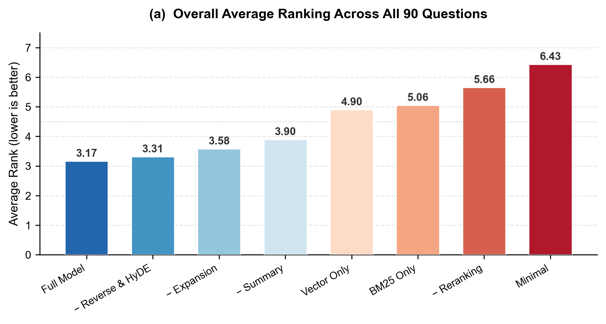
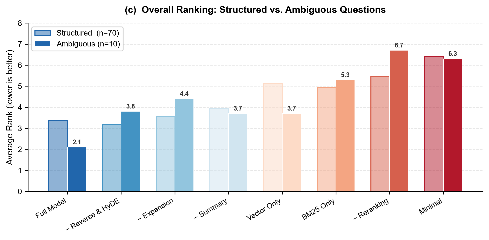
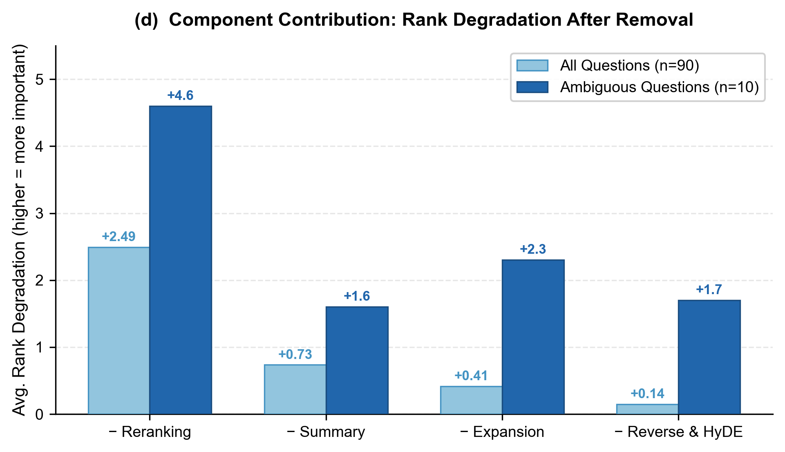

# 酒店评论分析与智能问答系统

基于 2500+ 条真实住客评论的可视化分析平台，集成 RAG（检索增强生成）智能问答系统

## 功能特性

### 评论浏览

- 多维度筛选：日期范围、评分、房型、出行类型、话题类别、评论质量
- 关键词搜索与多种排序方式（发布时间、评分、质量分、点赞数、回复数）
- 评论卡片展示：评分、日期、配图画廊、分类标签

### 数据看板

- 核心指标：评论总数、平均评分、高质量评论占比
- 评分分布、月度趋势、话题类别、房型与出行类型等可视化图表
- 支持点击图表直接跳转至对应筛选条件的评论

### RAG 智能问答

- 意图识别：自动判断是否需要检索评论数据
- 意图检测：自动识别用户 Query 中的房型约束（用于检索阶段）和时效性需求（用于重排阶段）
- 意图扩展：理解并改写用户 Query 为 1-3 个子意图并分配权重
- 五路混合检索：BM25 文本匹配、向量语义检索、反向 Query 匹配、*HyDE 生成与匹配（暂未启用）*、类别摘要检索，加权 RRF 融合
- 多因子重排：Qwen3-Rerank 相关性打分 + 线性加权排序（相关性、内容质量、时效性）
  - 内容质量：含评论质量分、评论长度、回复数、点赞数等特征
  - 时效性：使用半衰期模型，衰减率受意图检测结果影响 *（注：评论数据截止至 2025/4/18）*
- 流式回答生成：基于检索上下文的 LLM 流式输出
- 单轮上下文记忆：自动携带上一轮对话，支持追问
- 展示参考评论来源，支持终止生成与清除对话
- 国际双模式部署：支持全北京模式和国际混合模式（新加坡+北京）

## 系统架构

```
┌─────────────────────────────────────────┐
│          Next.js 前端 (Vercel)          │
│    评论浏览 | 数据看板 | RAG 智能问答     │
└───────────────────┬─────────────────────┘
                    │ SSE / REST
                    ▼
┌─────────────────────────────────────────┐
│     Python FastAPI 服务 (Zeabur HK)      │
│    查询处理 → 混合检索 → 重排 → 流式生成   │
└────────┬──────────┬──────────┬──────────┘
         │          │          │
         ▼          ▼          ▼
     Insforge  DashVector   本地文件
     (评论DB)  (向量检索)  (BM25索引/ChromaDB)
```

## 技术栈

| 层级 | 技术 |
|------|------|
| 前端框架 | Next.js 15 (App Router) + TypeScript |
| 样式 | Tailwind CSS |
| 图表 | Recharts |
| 数据库 | Insforge (PostgreSQL) |
| RAG 后端 | Python FastAPI + Uvicorn |
| LLM / Embedding / Rerank | DashScope API (Qwen / DeepSeek) |
| 向量数据库 | DashVector (云端) + ChromaDB (本地) |
| 文本检索 | BM25 + jieba 分词 |

## 快速开始

### 环境要求

- Node.js 18+
- Python 3.10+

### 1. 安装依赖

```bash
# 前端依赖
npm install

# RAG 服务依赖
pip install -r rag-service/requirements.txt
```

### 2. 配置环境变量

复制 `.env.example` 为 `.env` 并填入实际值：

```bash
cp .env.example .env
```

需要配置的变量：

| 变量 | 说明 |
|------|------|
| `NEXT_PUBLIC_INSFORGE_BASE_URL` | Insforge 后端地址 |
| `NEXT_PUBLIC_INSFORGE_ANON_KEY` | Insforge 匿名密钥 |
| `NEXT_PUBLIC_PYTHON_API_URL` | RAG 服务地址（开发环境 `http://localhost:8000`） |
| `DASHSCOPE_API_KEY` | DashScope API Key（北京端点） |
| `DASHSCOPE_INTL_API_KEY` | DashScope API Key（新加坡端点，可选） |
| `DASHVECTOR_API_KEY` | DashVector API Key |
| `DASHVECTOR_HOTEL_ENDPOINT` | DashVector 集合端点 |

### 3. 启动服务

```bash
# 终端 1：启动 RAG 后端（端口 8000）
cd rag-service
uvicorn main:app --reload --port 8000

# 终端 2：启动 Next.js 前端（端口 3000）
npm run dev
```

访问 [http://localhost:3000](http://localhost:3000)

## 项目结构

```
hotel-review-rag/
├── src/                          # Next.js 前端源码
│   ├── app/                      # 页面路由
│   │   ├── page.tsx              # 评论浏览页（首页）
│   │   ├── dashboard/page.tsx    # 数据看板
│   │   └── qa/page.tsx           # RAG 智能问答
│   ├── components/               # 组件库
│   │   ├── charts/               # 图表组件
│   │   ├── comments/             # 评论组件
│   │   ├── qa/                   # 问答组件
│   │   └── ui/                   # 通用 UI 组件
│   ├── lib/                      # 工具库
│   │   ├── api.ts                # 数据库 API 封装
│   │   ├── qa.ts                 # RAG API 客户端
│   │   └── qa-background.ts      # 后台流式问答
│   └── types/                    # TypeScript 类型定义
├── rag-service/                  # Python RAG 后端
│   ├── main.py                   # FastAPI 入口
│   ├── config.py                 # 配置（模型、常量）
│   ├── modules/                  # RAG 核心模块
│   │   ├── clients.py            # LLM / Embedding 客户端
│   │   ├── intent.py             # 查询处理
│   │   ├── retriever.py          # 混合检索
│   │   ├── ranker.py             # 重排
│   │   ├── generator.py          # 流式回复生成
│   │   ├── index.py              # BM25 倒排索引
│   │   └── rag_system.py         # RAG 系统主类
│   ├── utils/                    # 工具函数
│   │   └── database.py           # Insforge 数据库连接
│   ├── data/                     # 离线数据
│   │   ├── chroma_db             # Chroma 摘要数据库
│   │   └── inverted_index.pkl    # BM25 倒排索引
│   ├── requirements.txt          # Python 依赖
│   ├── Procfile                  # 部署启动命令
│   └── runtime.txt               # Python 版本
├── .env.example                  # 环境变量模板
├── package.json                  # Node.js 依赖
└── README.md
```

注：`RAG` 文件夹为原始 Jupyter Notebook 代码（完整 RAG 系统实现）

## RAG 问答流程

> 完整模型框架见 [`RAG/项目框架.md`](RAG/项目框架.md)

```
用户提问
  │
  ▼
意图识别（判断是否需要检索）
  │
  ├─ 不需要检索 ──> 直接生成回答
  │
  ├───> 意图检测（房型识别、时效性判断，与意图扩展并行）
  │
  ▼
意图扩展（生成同义/近义查询，含意图权重）
  │
  ▼
混合检索（多路并行）
  ├─ BM25 文本匹配
  ├─ 向量语义检索（DashVector）
  ├─ 反向 Query 匹配（DashVector）
  ├─ HyDE 生成与检索（DashVector，暂未启用）
  ├─ 类别摘要检索（ChromaDB）
  └─ 加权 RRF 融合排序（权重由意图扩展给出）
  │
  ▼
 重排
  ├─ Qwen3-Rerank 相关性打分
  └─ 多因子排序（相关性 40% + 内容质量 40% + 时效性 20%）
  │
  ▼
Top-10 评论 + 类别摘要 + 上一轮对话问答 ──> 组装上下文
  │
  ▼
LLM 流式生成回答
```

## RAG 系统评估

> 详细评估报告见 [`RAG/模型评估.md`](RAG/模型评估.md)

### 评估方法

采用 **排名制消融实验**：对 8 种系统配置（完整模型 + 7 种消融变体），在 90 个测试问题上生成共 720 条回复，由评估模型 (Qwen3-Max) 在匿名打乱条件下进行 7 维度排名对比（意图理解度、内容覆盖度、观点平衡性、引用溯源性、时效合理性、表达专业度、综合表现）

### 综合排名



结果呈 **"两梯队"格局**：完整模型 (3.17) 领先，关闭增强召回 (3.31)、关闭意图扩展 (3.58)、关闭摘要 (3.90) 紧随其后；而纯向量 (4.90)、纯BM25 (5.06)、关闭重排 (5.66)、最简配置 (6.43) 出现明显断层

### 结构化 vs. 模糊性问题



完整模型在模糊性问题上排名 **2.1**，远超第二名 (3.7)，而在结构化问题上各配置差距较小，说明增强召回与意图扩展在模糊场景下不可替代；纯向量检索在模糊问题上 (3.7) 明显优于纯 BM25 (5.3)，体现语义匹配对开放性提问的优势

### 组件贡献度



各模块对系统整体性能的贡献由高到低为：

```
多因子重排 >> 类别摘要 > 意图扩展 > 增强召回 (反向+HyDE)
```

面对模糊性问题时，各模块的贡献度均被放大，排序调整为：

```
多因子重排 >> 意图扩展 > 增强召回 (反向+HyDE) ≈ 类别摘要
```

## 部署

### 前端部署（Vercel）

1. 将仓库连接到 [Vercel](https://vercel.com)
2. 配置环境变量（`NEXT_PUBLIC_*` 开头的变量）
3. 自动部署

### 后端 RAG 服务部署（Zeabur 香港节点）

> 由于 RAG 服务需调用阿里云 DashScope / DashVector API（中国大陆），因此需部署在对大陆网络通畅的节点，推荐使用 Zeabur 香港区域

1. 在 [Zeabur](https://zeabur.com) 创建新项目，选择 **Hong Kong** 区域
2. 连接 GitHub 仓库，指定根目录为 `rag-service/`
3. 配置环境变量（`DASHSCOPE_API_KEY`、`DASHVECTOR_*`、`NEXT_PUBLIC_INSFORGE_*`）
4. 可选：配置 `DASHSCOPE_INTL_API_KEY` 启用国际混合模式（意图识别和重排保持北京，其余切换新加坡）
5. Zeabur 会自动识别 `Procfile` 和 `runtime.txt` 进行部署

部署后将 RAG 服务的公网地址填入 Vercel 的 `NEXT_PUBLIC_PYTHON_API_URL` 环境变量，然后 Redeploy Vercel 项目

## API 接口

### RAG 问答

```
POST /api/v1/chat
Content-Type: application/json

{"query": "酒店有什么特色？", "history": {"user": "上一轮问题", "assistant": "上一轮回复"}}
```

`history` 字段可选，用于多轮对话上下文（仅传上一轮问答，不含参考评论）

响应为 SSE 流，事件类型：
- `intent` — 意图识别结果
- `references` — 检索到的参考评论
- `chunk` — 流式文本片段
- `done` — 生成完成

### 健康检查

```
GET /api/v1/health
```

## License

MIT
